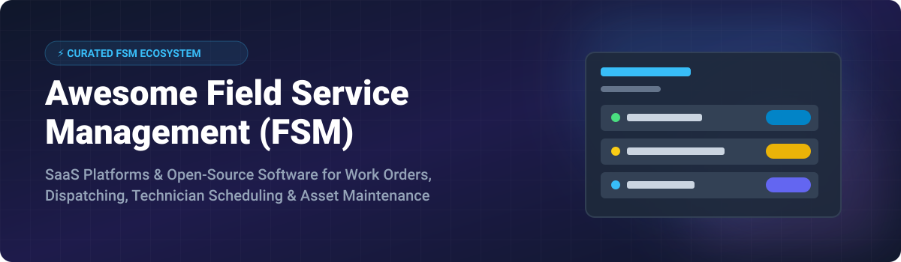

# Awesome Field Service Management (FSM) 🛠️📱⚙️

  

  
  
  
  

---

## 📌 Overview & Introduction

Welcome to the definitive **Awesome Field Service Management (FSM)** directory! 🚀 This repository tracks leading **SaaS software platforms** and **open-source GitHub projects** designed for modern field operations, technician dispatching, job scheduling, preventive maintenance, work order tracking, and mobile invoicing.

Whether you run a residential HVAC, plumbing, electrical, or landscaping business, or manage enterprise facility maintenance and asset-intensive field service, this curated resource helps you evaluate commercial SaaS vendors and self-hosted open-source FSM/CMMS platforms.

---

## 📖 Table of Contents 🗂️

- [☁️ SaaS & Commercial FSM Platforms](#-saas--commercial-fsm-platforms)
- [🔓 Open-Source & Self-Hosted FSM Repositories](#-open-source--self-hosted-fsm-repositories)
- [🤝 How to Contribute](#-how-to-contribute)
- [☕ Support & Sponsorship](#-support--sponsorship)
- [⚠️ Disclaimer](#%EF%B8%8F-disclaimer)
- [📈 Star History](#-star-history)

---

## ☁️ SaaS & Commercial FSM Platforms

> **📊 Market Size & Dynamics**: The global field service management (FSM) market size is estimated at **~$5.5 Billion in 2026** and is projected to reach **~$15 Billion by 2032**. The sector is **moderately fragmented**: **ServiceTitan** commands the residential trades segment (HVAC, plumbing, electrical), **Salesforce** and **Microsoft** lead enterprise ERP/CRM-integrated field operations, while **Jobber** and **Housecall Pro** compete heavily in the SMB market. No single vendor holds a winner-take-all monopoly.

The table below is sorted by **Company Size (Revenue / Market Valuation) in descending order**:

| Platform 🏢 | Description 📝 | Specific Starting Tier Pricing 💰 | Free Tier / Trial Limits ⏳ | Company Size (Revenue / Valuation) 📊 |
| :--- | :--- | :--- | :--- | :--- |
| **[Microsoft Dynamics 365 Field Service](https://dynamics.microsoft.com/en-us/field-service/)** 🟦 | Enterprise FSM with AI dispatch, IoT asset monitoring, and Mixed Reality remote assist. | **$105/user/month** (Field Service Attach) / **$145/user/month** (Standalone base). | **30-day full feature trial** (No perpetual free tier). | **~$245B Annual Revenue** (Microsoft FY2024) |
| **[Salesforce Field Service](https://www.salesforce.com/service/field-service/)** ☁️ | Enterprise field service engine native to Salesforce Service Cloud with VRP routing. | **$25/user/month** (Starter) up to **$150/user/month** (Enterprise Field Service). | **30-day full feature trial** (No perpetual free tier). | **~$34.9B Annual Revenue** (Salesforce FY2024) |
| **[ServiceTitan](https://www.servicetitan.com/)** 🛡️ | Dominant trade software for residential HVAC, plumbing, electrical, & contractor fleets. | **$398/month per technician** (Starter package starting tier). | **Interactive demo only** (No public free trial or free tier). | **~$9.5B Valuation** (Public IPO Filing / Private Valuation) |
| **[ServiceMax (PTC)](https://www.servicemax.com/)** ⚙️ | Asset-centric enterprise FSM for medical devices, industrial equipment, & complex machinery. | **$65/user/month** (Standard field technician starting seat price). | **Guided sandbox demo** (No self-serve free trial). | **~$2.1B Enterprise Value** (Acquired by PTC) |
| **[Simpro](https://www.simprogroup.com/)** 🏗️ | End-to-end job management & dispatch software for commercial trade contractors. | **$129/user/month** (Minimum 5-user contract requirement). | **14-day full feature trial** (No perpetual free tier). | **~$300M ARR / Valuation** (K1 Investment Backed) |
| **[Housecall Pro](https://www.housecallpro.com/)** 🏠 | All-in-one mobile dispatch, estimation, and billing app for service professionals. | **$79/month** (Basic Tier, up to 1 user). | **14-day full feature trial** (No perpetual free tier). | **~$1B+ Valuation** (Unicorn status) |
| **[Jobber](https://getjobber.com/)** 🛠️ | Popular SMB scheduling, quoting, customer portal, and invoice platform for home trades. | **$39/month** (Core plan, 1 user billed annually). | **14-day free trial** (No credit card required). | **~$100M+ ARR** (Summit Partners Backed) |
| **[Praxedo](https://www.praxedo.com/)** 🚚 | European cloud FSM solution for telecom, utility, and equipment maintenance fleets. | **$35/user/month** (Standard mobile technician plan). | **15-day free trial** (No perpetual free tier). | **~$50M ARR** (Leading European Provider) |

---

## 🔓 Open-Source & Self-Hosted FSM Repositories

The open-source field service ecosystem provides self-hosted alternatives for work orders, CMMS, asset tracking, and contractor dispatching. 

The table below is sorted by **GitHub Star Count in descending order**:

| Repository 📦 | Description & Key Features 📋 | Stars ⭐️ |
| :--- | :--- | :---: |
| **[Odoo Field Service](https://github.com/odoo/odoo)** 💜 | **Dedicated open-source FSM module within the Odoo ERP suite.** Integrates work orders directly with CRM, inventory, purchase orders, and invoicing. Includes mobile technician view and map dispatching. |  |
| **[openMAINT](https://github.com/tecnoteca/openmaint)** 🏛️ | **Enterprise open-source CMMS & IWMS platform.** Built for property, facility, and building asset maintenance, work order scheduling, and preventive maintenance plans. |  |
| **[Grash CMMS (Atlas CMMS)](https://github.com/grashjs/cmms)** ⚡ | **Modern TypeScript & React CMMS for field service & maintenance.** Features preventive maintenance, work orders with time tracking, asset hierarchies, inventory alerts, and Google Maps integration. |  |
| **[FlexDesk](https://github.com/Paulo-BatistaFerraz/flexdesk)** 🔌 | **Open-source FSM for HVAC, plumbing, & electrical contractors.** NestJS backend, Next.js frontend, React Native mobile app with offline support, Stripe payments, and Twilio SMS. |  |
| **[WCC CMMS](https://github.com/devdave-online/WCC_CMMS)** 🛠️ | **Multi-lingual self-hosted CMMS.** Unlimited seats, 34 languages supported, offline Android app, asset tracking, and AI maintenance assistant support. PHP & MySQL stack. |  |
| **[SuperCMMS](https://github.com/SuperCMMS/Open-Source-CMMS)** 📑 | **Lightweight open-source CMMS backend.** Manages asset inventories, work order tickets, preventive maintenance routines, QR code scans, and spare parts catalog. |  |
| **[Nexus Field Service](https://github.com/azaharizaman/nexus-field-service)** 🧭 | **Framework-agnostic PHP package for field dispatch & SLA management.** Features SHA-256 customer signatures, automated SLA breach alerts, and VRP route optimization algorithms. |  |
| **[Fieldboard](https://github.com/fieldboard/fieldboard)** 🎨 | **React 19 & Tailwind dispatch board component.** Features travel-aware schedule slots, skill matching, unassigned job backlog virtualization, and real-time risk detection. |  |

---

## 🤝 How to Contribute 💡

Contributions are welcome! If you know of an awesome SaaS product or open-source field service repo that isn't listed here:

1. Fork this repository 🍴
2. Create a new branch (`git checkout -b add-new-fsm-tool`)
3. Add your item to `README.md` maintaining alphabetical or star/company size sorting
4. Submit a Pull Request with a clear description 🚀

---

## 💖 Support & Sponsorship 🙏

If you find this curated list helpful for your research, team, or business, please consider showing your support:

- ⭐️ **Star** this repository on GitHub to help others discover it!
- 🔀 **Fork** and share it with your network, colleagues, or trade associations.
- ☕ **Sponsor / Buy me a coffee**: If you'd like to support ongoing updates and open-source maintenance, consider sponsoring via my [GitHub Sponsor Dashboard](https://github.com/sponsors/ishandutta2007).

---

## ⚠️ Disclaimer 📜

- This directory is **community-curated** for research and educational purposes.
- Field service management software often handles sensitive location data, customer PII, and financial records. Ensure compliance with GDPR, CCPA, and relevant industry regulations.
- Pricing details, features, and star counts are regularly updated but subject to change by respective vendors and maintainers.

---

## 📈 Star History 🌟

---

Made with ❤️ for field service contractors, dispatchers, maintenance engineers, and open-source developers worldwide.

